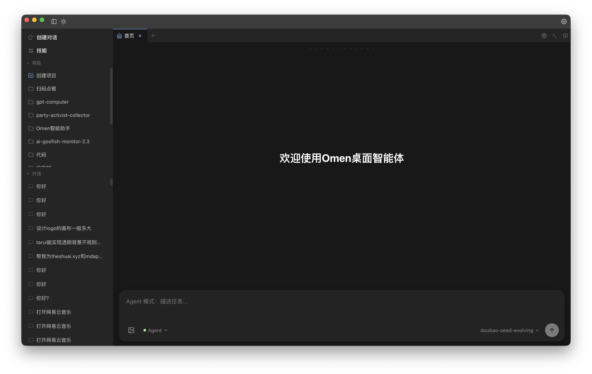
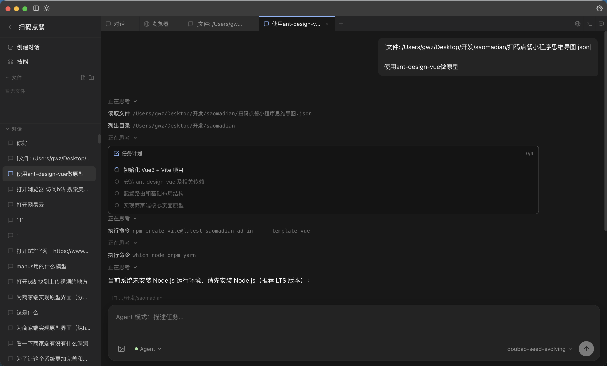
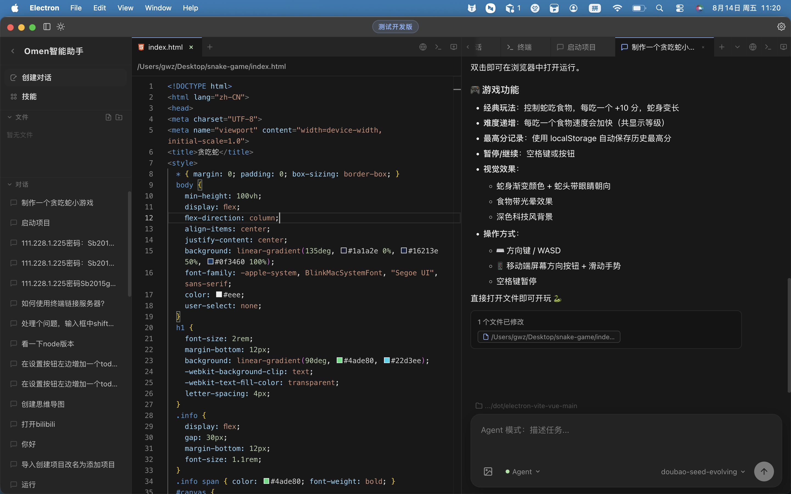
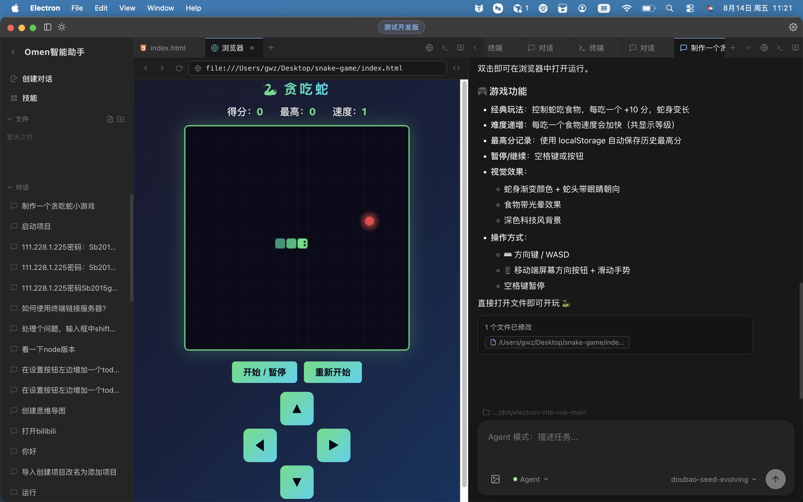
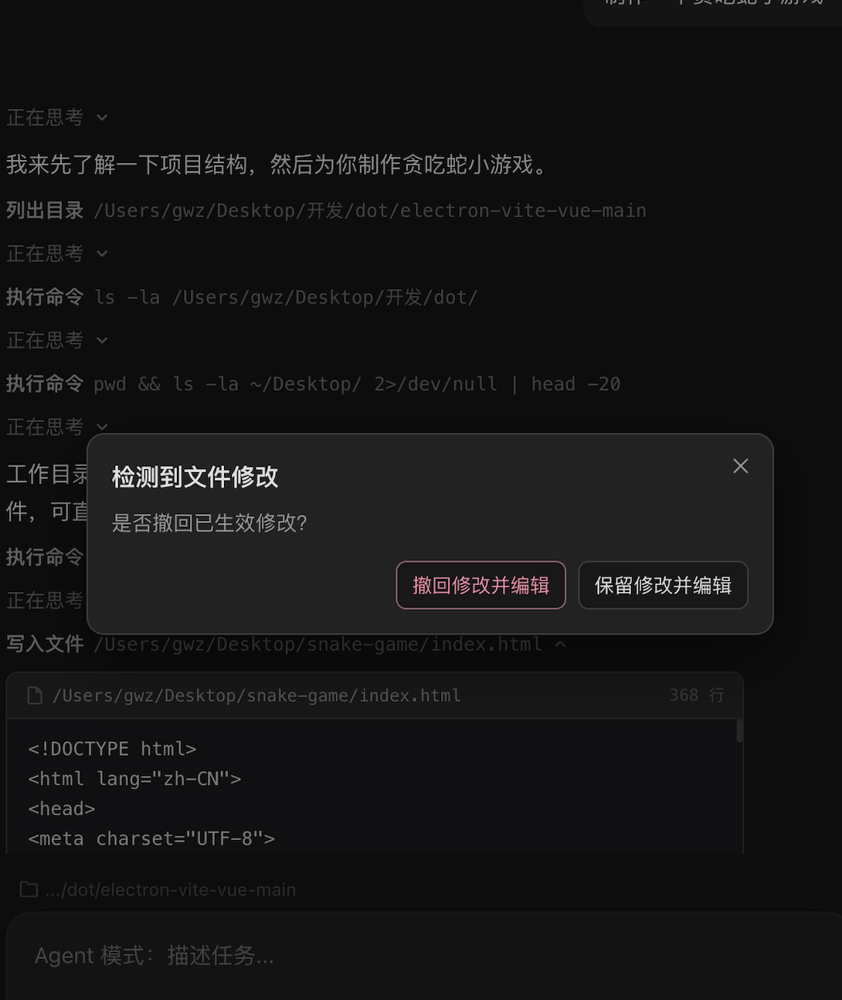
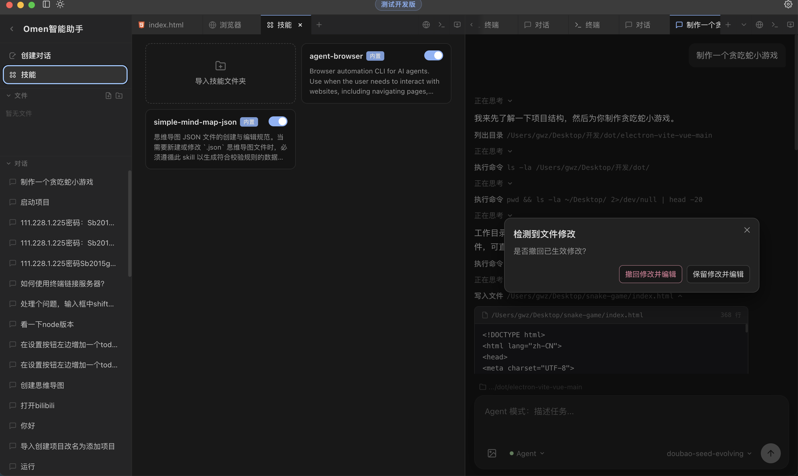

# Omen 桌面智能体

Omen 是一款面向开发者的 **AI 桌面智能助手**，将对话、代码编辑、终端、浏览器预览和技能扩展整合在同一工作区中。你可以用自然语言描述任务，Agent 会自动读写文件、执行命令、规划步骤并完成开发工作。

<p align="center">
  
</p>

## 预览

| Agent 驱动开发 | 内置代码编辑器 |
|:---:|:---:|
|  |  |

| 浏览器实时预览 | 对话/代码撤销操作 |
|:---:|:---:|
|  |  |

| 技能系统 |
|:---:|
|  |

## 核心特性

### AI 对话与 Agent 模式

- **Chat 模式**：日常问答、技术咨询、方案讨论
- **Agent 模式**：自主规划任务、读写文件、执行 Shell 命令、跟踪多步进度
- 支持多模型 Provider 配置（OpenAI 兼容 API），可切换不同模型
- 支持图片输入，流式输出响应

### 项目管理

- 按项目组织对话历史，侧边栏快速切换
- 内置文件树，支持新建、重命名、删除文件与文件夹
- 双击 HTML 文件可在内置浏览器中预览

### 多面板工作区

- **代码编辑器**：基于 Monaco Editor，支持语法高亮与思维导图预览
- **内置终端**：xterm.js + node-pty，可创建多个持久化终端会话
- **浏览器标签**：WebView 内嵌预览本地或远程页面
- **窗口监视器**：实时捕获系统窗口画面，辅助视觉类任务
- 标签页可拖拽分屏，自由组合布局

### 技能系统（Skills）

通过 Skills 扩展 Agent 能力，内置技能包括：

| 技能 | 说明 |
|------|------|
| **agent-browser** | 浏览器自动化 CLI，支持导航、填表、截图、数据抓取等 |
| **simple-mind-map-json** | 思维导图 JSON 创建与编辑规范，编辑器内可切换脑图预览 |

也支持导入自定义技能文件夹，按需启用/禁用。

### 开发者体验

- 文件修改检测，Agent 写入代码时可选择保留或撤回
- 工具调用卡片实时展示 Agent 执行步骤（读文件、运行命令、更新计划等）
- 深色/浅色主题切换
- macOS 原生窗口风格

## 技术栈

| 层级 | 技术 |
|------|------|
| 桌面框架 | Electron 29 |
| 前端框架 | Vue 3 + TypeScript |
| 构建工具 | Vite 5 |
| 代码编辑 | Monaco Editor |
| 终端 | xterm.js + node-pty |
| AI SDK | Vercel AI SDK |
| 思维导图 | simple-mind-map |

## 快速开始

### 环境要求

- Node.js 18+
- npm 或 pnpm

### 安装与运行

```bash
cd electron-vite-vue-main

# 安装依赖
npm install

# 启动开发模式
npm run dev
```

### 配置模型

1. 启动应用后，进入**设置**
2. 添加 Provider（名称、API Key、Base URL）
3. 获取或手动添加可用模型列表
4. 选择默认模型后即可开始对话

### 打包构建

```bash
npm run build
```

## 使用示例

- 「帮我初始化一个 Vue3 + Vite 项目，并安装 ant-design-vue」
- 「制作一个贪吃蛇小游戏，深色科技风，支持键盘和触控操作」
- 「打开 localhost:5173 截图，检查页面布局是否正常」
- 「根据这份思维导图 JSON，生成商家端管理后台原型页面」

## 项目结构

```
dot/
├── electron-vite-vue-main/     # Omen 主应用
│   ├── electron/               # Electron 主进程（Agent、终端、技能等）
│   ├── src/                      # Vue 渲染进程（UI 组件）
│   ├── builtin-skills/           # 内置技能
│   └── package.json
├── gpt-computer/                 # VLM 电脑操作工具（独立子项目）
│   └── thenextagent/
└── previewimg/                   # 应用预览截图
```

## 子项目

### gpt-computer / thenextagent

基于 Qwen-VL 视觉语言模型的电脑自动化操作工具，可通过自然语言指令控制鼠标、键盘完成桌面任务。详见 [`gpt-computer/thenextagent/README.md`](gpt-computer/thenextagent/README.md)。

## License

MIT
